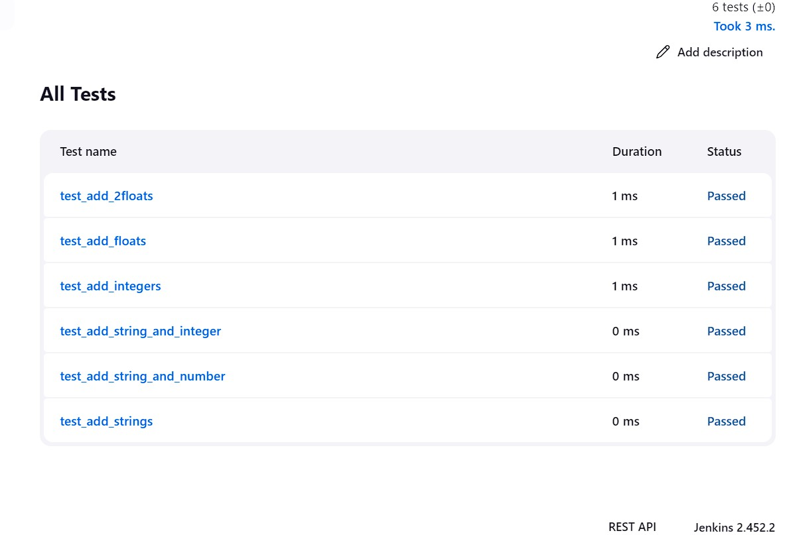

# simple-python-pyinstaller-app

This repository is for the
[Build a Python app with PyInstaller](https://jenkins.io/doc/tutorials/build-a-python-app-with-pyinstaller/)
in the [Jenkins User Documentation](https://jenkins.io/doc/).

The repository contains a simple Python application which is a command line tool "add2vals" that outputs the addition of two values. If at least one of the
values is a string, "add2vals" treats both values as a string and instead
concatenates the values. The "add2" function in the "calc" library (which
"add2vals" imports) is accompanied by a set of unit tests.

Test cases are validated with pytest and the results are saved to a JUnit XML report.

The delivery of the "add2vals" tool through PyInstaller converts this tool into
a standalone executable file for Linux, which you can download through Jenkins build
and can be executed at the command line on Linux machines without Python.

The `jenkins` directory contains an example of the `Jenkinsfile` (i.e. Pipeline)

# Test Cases

Results from Jenkins Build

# Command Line

Run it with input values

